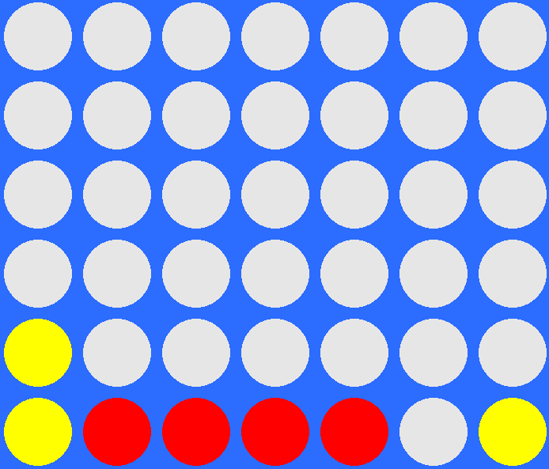
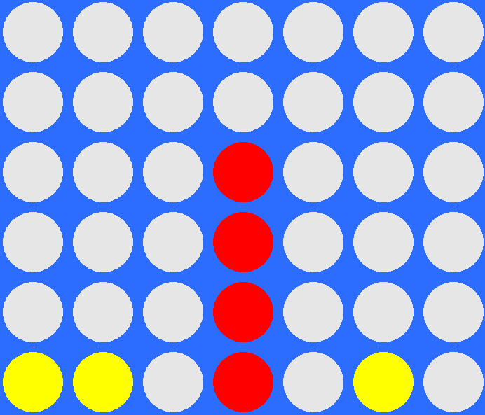
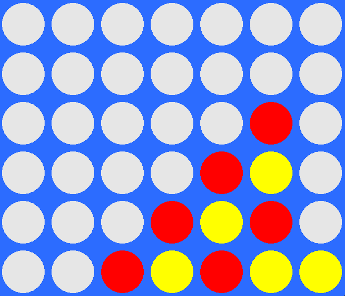
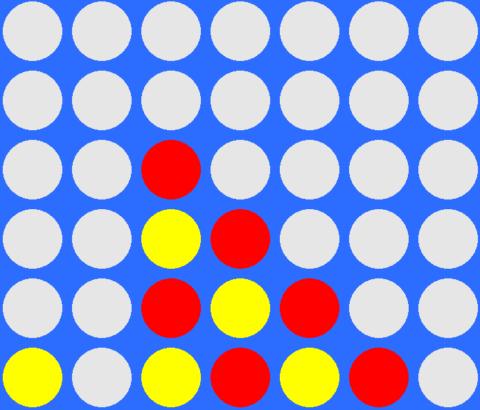
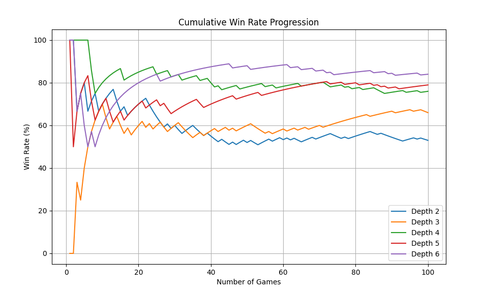
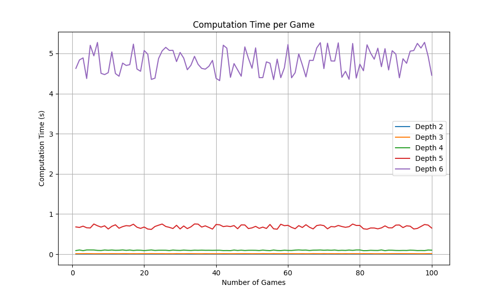
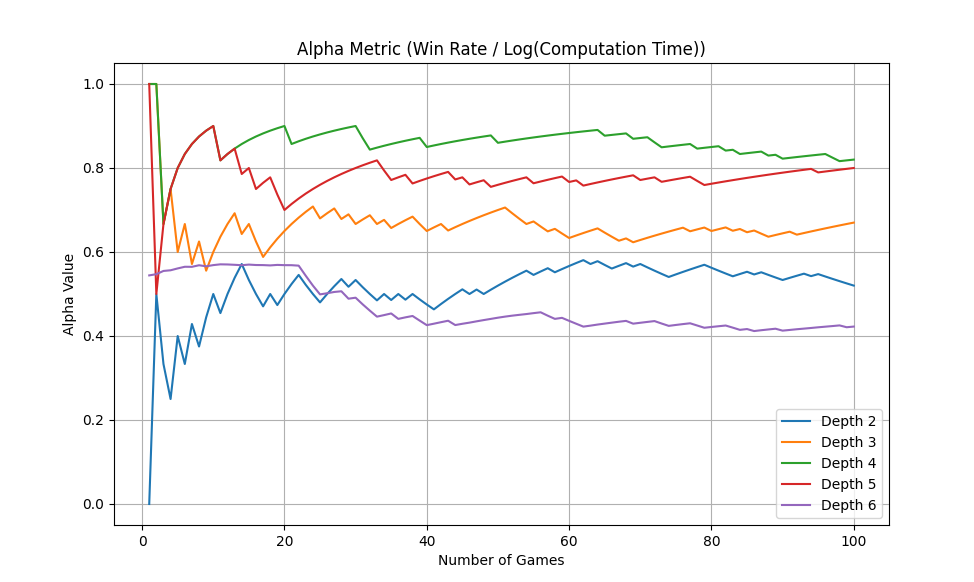

# Connect Four AI
Chen Sabag
## Description
This is a Connect Four game with AI implementation. Players can compete against each other or against an AI. The project is built using Python and Pygame.

The game is played on a grid of 6x7 slots that start blank, and can be filled with red or yellow discs.
<p align="center">
  
</p>

The goal is to connect 4 discs of the same color, before the second player manages to do so. <br> There are 4 different legal ways to do it: <br> <br>
Horizontally - 
<p align="center">
  
</p>
<br> <br>
Vertically - 
<p align="center">
  
</p>
<br> <br>
Positive diagonally - 
<p align="center">
  
</p>
<br> <br>
Or negative diagonally - 
<p align="center">
  
</p>
<br> <br>

Each one of those sequences of discs will result in a victory and the end of the game.
<br>
In my project i built an ai player to play the game against a player or another ai player, in order to check how well different ai models perform in this challenge.

## The Problem
My goal is to develop a smart AI capable of performing at a "very hard" difficulty level, while striking a balance between computational efficiency and the intelligence of its decision-making. This ensures the AI is both challenging and performant without causing noticeable delays.

## Development Journey: Improving the AI
To develop a robust AI for Connect Four, I went through several stages of improvement:
1. **Random Column Picker:**  
   Initially, the AI simply chose a random column to drop its disc. While functional, this method had no strategy and frequently resulted in poor performance.<br> <br>
2. **Best Move (Trivial):**  
   The next step was creating a `best_move_trivial` function. This function evaluated each column and selected the first column that would result in an immediate win. If no winning move was found, it would default to the first available column. While better than the random picker, this approach lacked foresight and often missed opportunities or fell into traps. <br><br>
 3. **Minimax Algorithm:**  
   To significantly enhance the AI, I implemented the Minimax algorithm, which evaluates game states by simulating all possible moves up to a specified depth. Its goal is to maximize the AI’s advantage while minimizing the opponent’s chances of success.  
   - **Scoring System:** A scoring mechanism was developed to evaluate board configurations, assigning higher scores to favorable setups (e.g., those closer to a win) and prioritizing blocking the opponent’s winning moves.
   - **Depth Limitation:** To manage computational costs, the algorithm was restricted to a fixed depth, balancing decision quality with performance.
   - **Recursive Search:** Minimax uses a recursive search to explore game states, alternating between maximizing the AI’s position and minimizing the opponent’s advantage. <br> <br>
   While Minimax significantly improved the AI’s gameplay, it faced a critical limitation: the exponential growth of computation time with increased depth. Though increasing the depth made the AI smarter by looking further ahead, it caused delays that disrupted the game's flow. This trade-off underscored the need for a more efficient approach, leading to the next enhancement: alpha-beta pruning. 
  4. **Minimax with Alpha-beta pruning:** <br>
    To optimize Minimax, I added Alpha-beta pruning, which improves performance by reducing the number of nodes the algorithm evaluates. Alpha-beta pruning eliminates branches in the game tree that don't need exploration, speeding up decision-making without compromising the AI's play quality. <br>
    - **Alpha:** The best score for the maximizing player (AI).<br>
    - **Beta:** The best score for the minimizing player (opponent) <br>
    This allows the AI to explore deeper moves faster, improving its efficiency while keeping decision quality intact. With Alpha-beta pruning, the AI can make quicker decisions by pruning unnecessary branches, allowing it to evaluate more moves in less time.
        
## Code Overview
I used the following libraries:

  - **Pygame:** A Python library for creating game logic and graphical user interfaces (GUIs).

  - **Numpy:** A Python library for numerical computations, used here to handle the board as a numpy array.

  - **Math and Random:** Used for mathematical computations related to the game logic and for introducing randomness.

Before defining the functions, I listed all the attributes and global variables needed for the game logic and GUI.

### Main Functions:
  - **Board related:**
    - `drop_piece` : Inserts a disc into the chosen position with an animation of it dropping.
    - `copy_drop_piece` : Simulates piece drops for the algorithm's "future sight" feature(without animation).
    - `initialize_board` : Initializes the game to start.
    - `draw_board` : Draws the discs in their correct positions based on the board array values.
  - **Algorithm related:**
    - `find_winning_move` : An intuitive function that loops through the board to find immediate winning moves. This is necessary because the AI's minimax algorithm assumes the opponent plays optimally, which may not always be true for human players. Without this function, the AI can behave abnormally when the human player makes mistakes. By prioritizing immediate winning moves, the AI ensures it capitalizes on opportunities before invoking the minimax algorithm.
    - `connect_eval` + `score_position` : Functions that implement the algorithm's scoring mechanism, influencing its decision-making process.
    - `minimax` : The main algorithm function that contains the AI's decision-making logic. It looks *depth* steps ahead into the game, considers all possibilities, and uses the scoring mechanism to determine the optimal move for the current board state.
  - **Game logic related:**
    - `check_win` : Scans the board for four consecutive discs of the same color. It leverages helper functions (`check_directions` and `check_line`) to efficiently scan the board.
  - **Gui related**
    - `draw_home_screen` :Displays a home screen before the game starts. The home screen features a Connect-4 logo sourced from Google, which I extended using Photoshop's AI tool to fit the game's dimensions.
    - `fade_to_black` : Creates a fade effect when starting the game.
    - `winner_screen` : Displays a "game over" screen showing the winner and instructions on how to restart or quit the game.

After defining the functions, the main game loop is implemented. It contains the event-handling mechanism for gameplay, including features such as AI vs. AI simulation, restart functionality, and quitting options.    

## Experiments: Minimax Depth Analysis
  To evaluate the performance of different depths of the minimax algorithm, I ran 100 simulated games for depths 2 through 6 against a depth-1 opponent, where the starting player was chosen at random. <br>
  Metrics:
  - **Win Rate:** The percentage of games won.
  - **Computation Time:** The average time spent by the AI per turn in a game.
  - **Alpha Metric:** The Alpha metric evaluates AI performance by combining win rate and computational cost. The formula is:
    ```
    Alpha = Win Rate * Penalty Factor
    ```
    Penalty Factor Logic:
    - For turn times ≤ 1 second: Penalty = 1.0 (minimal impact)
    - For turn times > 1 second: Penalty = 1 / log(turn_time - threshold + 2) <br>

    Key Features:
    - Minimal penalty for quick turns (< 1s)
    - Progressively harsher penalty for longer turns
    - Rewards both high win rates and computational efficiency <br>

    Example:
    - Quick turn (0.5s): Full win rate preserved
    - Slow turn (5s): Significant reduction in alpha value <br>

    This approach ensures the AI is evaluated not just on winning, but on how efficiently it can make decisions.<br><br>
  

  ### Visualizations:

   - Win Rate Progression: Tracks win rate as games progress

        <p align="left">
        
      </p> <br>
      
  
  - Computation Time Analysis: Highlights the computational cost of increasing depth
        <p align="left">
        
      </p> <br>

  - Alpha Plot: Optimal Tradeoff Between Depth and Performance
      <p align="left">
            
          </p>

  ### Key Insights:
  From the visualizations, several important observations can be drawn about the performance of the minimax algorithm at varying depths:
  - Win Rate Progression (Graph 1)
    - **Observation:** Depth 6 achieved the highest win rate, followed by Depth 5, then Depth 4, and so on, with Depth 2 having the lowest win rate.
    - **Insight:** As expected, increasing the depth of the minimax algorithm improves decision-making and leads to better performance, resulting in higher win rates over time. <br> <br>
  - Computation Time Analysis (Graph 2)
    - **Observation:** Depths 2, 3, and 4 had negligible average turn times, while Depth 5 averaged just under 1 second per turn. Depth 6, however, required approximately 5 seconds per turn.
    - **Insight:** While higher depths improve performance, they come at an exponential computational cost. Depth 6 is likely impractical for real-time gameplay due to long delays between moves. <br> <br>
  - Alpha Plot (Graph 3)
    - **Observation:** Depth 4 achieved the highest alpha value, with Depth 5 close behind. Depth 6, despite its superior win rate, had the lowest alpha value due to its excessive computation time.
    - **Insight:** Depth 4 strikes the best balance between computational efficiency and performance, making it the optimal depth for a "very hard" AI. Depth 5 is a reasonable alternative but comes with a slight increase in delay. Depth 6, while effective in win rate, sacrifices usability due to its long computation times.
  
  


## Installation
1. Clone the repository:
   ```
   git clone https://github.com/chen7897/Connect_Four_AI
   ```
2. Set up a virtual environment:
   ```
   python -m venv venv
   venv\Scripts\activate
   ```
3. Install dependencies:
   ```
   pip install -r requirements.txt
   ```

## Usage
Run the game with:
```
python game.py
```

## AI Algorithm
**Minimax**: A decision-making algorithm used for two-player games to find the optimal move.


## Technologies Used
- Python
- Pygame
- NumPy
- Matplotlib (for visualizations)

